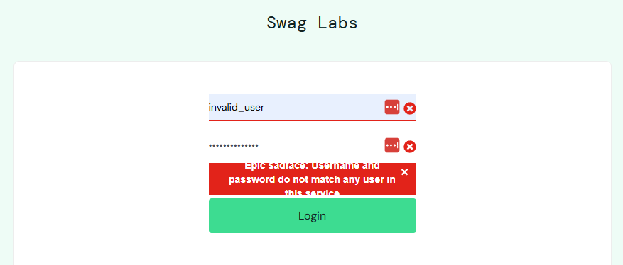

# BUG-001: Login Error Message Displays for Invalid Credentials

## Severity
Medium

## Priority
High

## Environment
- Browser: Chrome
- OS: Windows 11
- Application: SauceDemo
- URL: https://www.saucedemo.com/

## Steps to Reproduce
1. Navigate to the SauceDemo login page.
2. Enter an invalid username, such as `invalid_user`.
3. Enter an invalid password, such as `wrong_password`.
4. Click the Login button.

## Expected Result
Error message should clearly guide the user (e.g., suggest checking username format or password requirements).

## Actual Result
The application displays:
"Epic sadface: Username and password do not match any user in this service"

## Issue
The error message does not provide actionable guidance or suggestions for the user to correct the issue.

## Screenshot/Logs

## Status
Open

## Notes
This validates negative login behavior and confirms the system prevents access with invalid credentials.