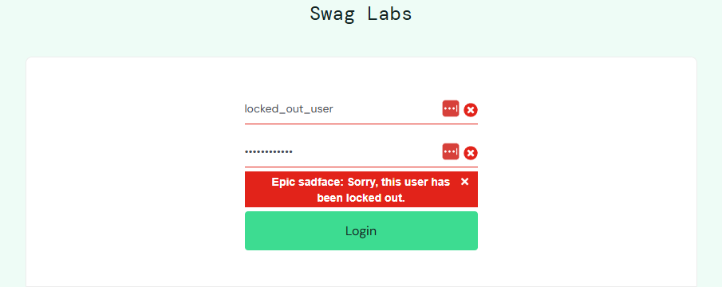

# BUG-002: Locked-Out User Error Message May Reveal Account Status

## Severity
Low

## Priority
Medium

## Environment
- Browser: Chrome
- OS: Windows 11
- Application: SauceDemo

## Steps to Reproduce
1. Navigate to https://www.saucedemo.com/
2. Enter username: `locked_out_user`
3. Enter password: `secret_sauce`
4. Click the Login button.

## Expected Result
The application should prevent login for locked-out users while displaying a secure, user-friendly message that does not reveal too much account status information.

## Actual Result
The application displays:  
`Epic sadface: Sorry, this user has been locked out.`

## Issue
The error message clearly confirms that the account exists and is locked out. In a production application, this could reveal account status information to unauthorized users.

## Screenshot/Logs

## Status
Open

## Notes
This confirms account access restrictions are enforced.